# Streamlit - Technical Architecture Documentation

## Executive Summary

Streamlit is a sophisticated open-source Python framework for building interactive web applications focused on data science and machine learning. This repository contains the complete source code for Streamlit's core library, implementing a client-server architecture with Python backend and React-based frontend, connected via WebSocket protocol using Protocol Buffers for efficient communication.

## System Architecture Overview

### High-Level Architecture

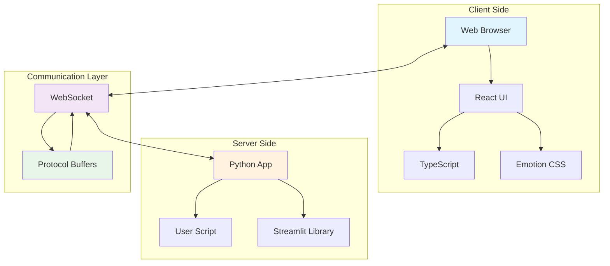
```mermaid
graph TB
    subgraph "Client Side"
        B[Web Browser]
        B --> R[React UI]
        R --> TS[TypeScript]
        R --> EM[Emotion CSS]
    end

    subgraph "Server Side"
        P[Python App]
        P --> US[User Script]
        P --> SL[Streamlit Library]
    end

    subgraph "Communication Layer"
        WS[WebSocket]
        PB[Protocol Buffers]
    end

    B <--> WS
    WS <--> P
    WS --> PB
    PB --> WS

    style B fill:#e1f5fe
    style P fill:#fff3e0
    style WS fill:#f3e5f5
    style PB fill:#e8f5e9
```

### Core Components

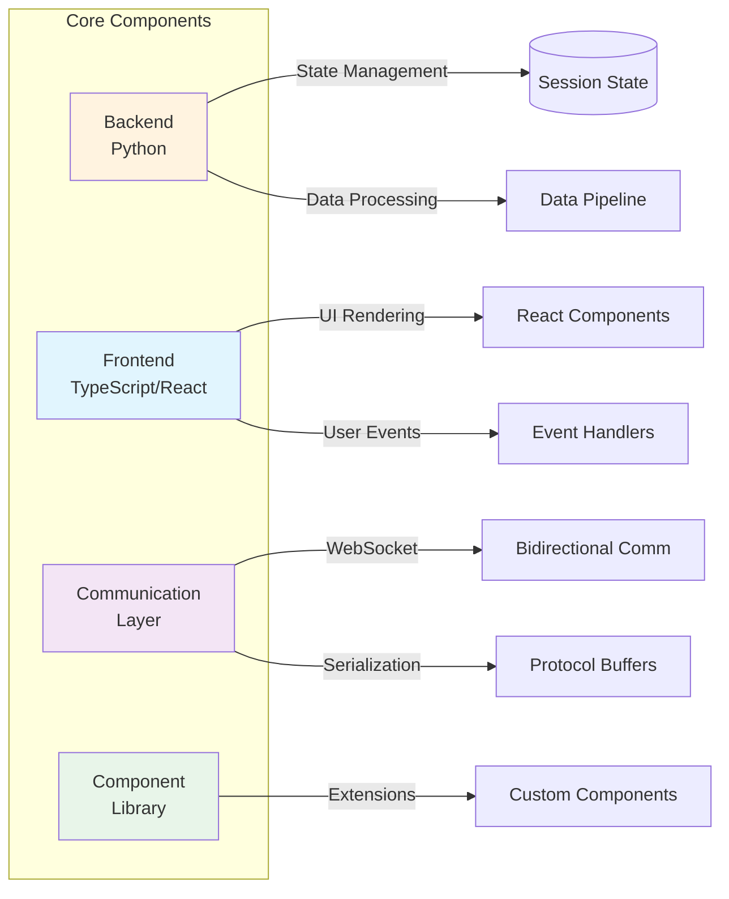
```mermaid
flowchart LR
    subgraph Core[Core Components]
        BE[Backend<br/>Python]
        FE[Frontend<br/>TypeScript/React]
        CL[Communication<br/>Layer]
        CM[Component<br/>Library]
    end

    BE -->|State Management| DB[(Session State)]
    BE -->|Data Processing| DP[Data Pipeline]
    FE -->|UI Rendering| UI[React Components]
    FE -->|User Events| EH[Event Handlers]
    CL -->|WebSocket| WS[Bidirectional Comm]
    CL -->|Serialization| PB[Protocol Buffers]
    CM -->|Extensions| CC[Custom Components]

    style BE fill:#fff3e0
    style FE fill:#e1f5fe
    style CL fill:#f3e5f5
    style CM fill:#e8f5e9
```

## Repository Structure

### Directory Architecture

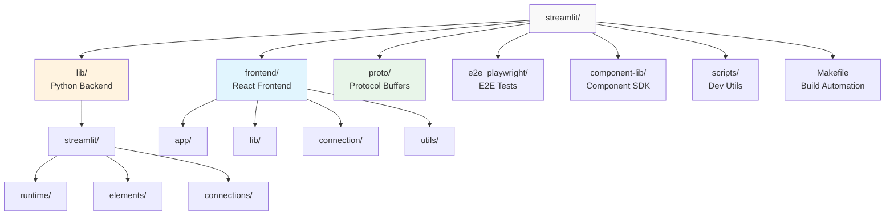
```mermaid
graph TD
    ROOT[streamlit/]
    ROOT --> LIB[lib/<br/>Python Backend]
    ROOT --> FE[frontend/<br/>React Frontend]
    ROOT --> PROTO[proto/<br/>Protocol Buffers]
    ROOT --> E2E[e2e_playwright/<br/>E2E Tests]
    ROOT --> COMP[component-lib/<br/>Component SDK]
    ROOT --> SCRIPTS[scripts/<br/>Dev Utils]
    ROOT --> MAKE[Makefile<br/>Build Automation]

    LIB --> STREAM[streamlit/]
    STREAM --> RUNTIME[runtime/]
    STREAM --> ELEM[elements/]
    STREAM --> CONN[connections/]

    FE --> APP[app/]
    FE --> LIB2[lib/]
    FE --> CONNECTION[connection/]
    FE --> UTILS[utils/]

    style ROOT fill:#f9f9f9
    style LIB fill:#fff3e0
    style FE fill:#e1f5fe
    style PROTO fill:#e8f5e9
```

## Backend Architecture

### Core Backend Components

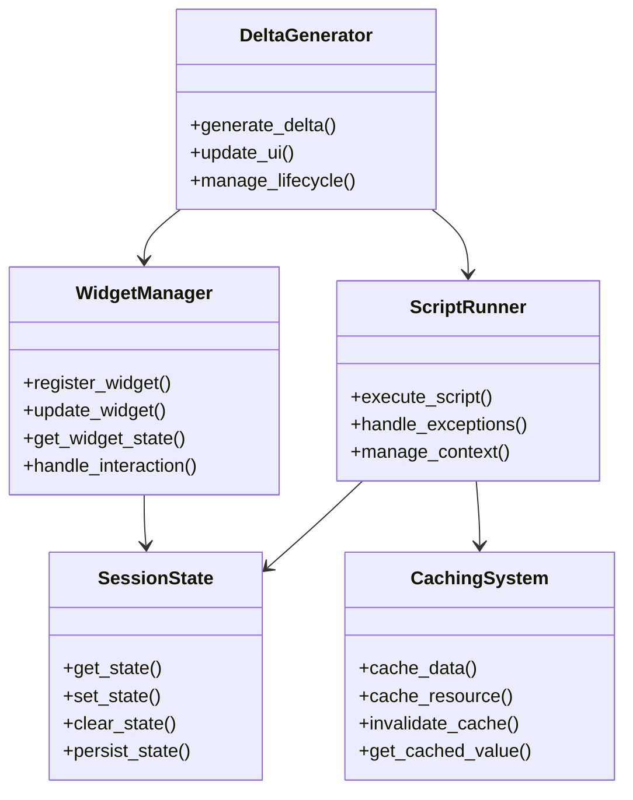
```mermaid
classDiagram
    class DeltaGenerator {
        +generate_delta()
        +update_ui()
        +manage_lifecycle()
    }

    class ScriptRunner {
        +execute_script()
        +handle_exceptions()
        +manage_context()
    }

    class SessionState {
        +get_state()
        +set_state()
        +clear_state()
        +persist_state()
    }

    class CachingSystem {
        +cache_data()
        +cache_resource()
        +invalidate_cache()
        +get_cached_value()
    }

    class WidgetManager {
        +register_widget()
        +update_widget()
        +get_widget_state()
        +handle_interaction()
    }

    DeltaGenerator --> ScriptRunner
    ScriptRunner --> SessionState
    ScriptRunner --> CachingSystem
    DeltaGenerator --> WidgetManager
    WidgetManager --> SessionState
```

### Backend Data Flow

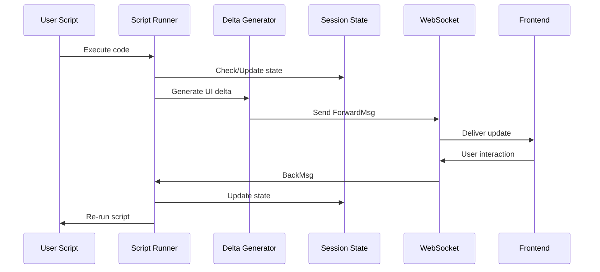
```mermaid
sequenceDiagram
    participant U as User Script
    participant SR as Script Runner
    participant DG as Delta Generator
    participant SS as Session State
    participant WS as WebSocket
    participant FE as Frontend

    U->>SR: Execute code
    SR->>SS: Check/Update state
    SR->>DG: Generate UI delta
    DG->>WS: Send ForwardMsg
    WS->>FE: Deliver update
    FE->>WS: User interaction
    WS->>SR: BackMsg
    SR->>SS: Update state
    SR->>U: Re-run script
```

## Frontend Architecture

### Frontend Component Hierarchy

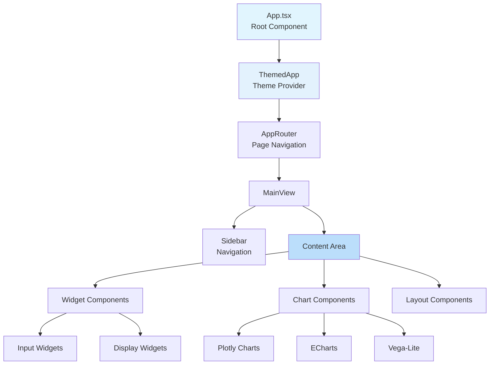
```mermaid
graph TD
    App[App.tsx<br/>Root Component]
    App --> Theme[ThemedApp<br/>Theme Provider]
    Theme --> Router[AppRouter<br/>Page Navigation]
    Router --> Main[MainView]

    Main --> Sidebar[Sidebar<br/>Navigation]
    Main --> Content[Content Area]

    Content --> Widgets[Widget Components]
    Content --> Charts[Chart Components]
    Content --> Layout[Layout Components]

    Widgets --> Input[Input Widgets]
    Widgets --> Display[Display Widgets]

    Charts --> Plotly[Plotly Charts]
    Charts --> Echarts[ECharts]
    Charts --> Vega[Vega-Lite]

    style App fill:#e1f5fe
    style Theme fill:#e3f2fd
    style Content fill:#bbdefb
```

### Component Communication Flow

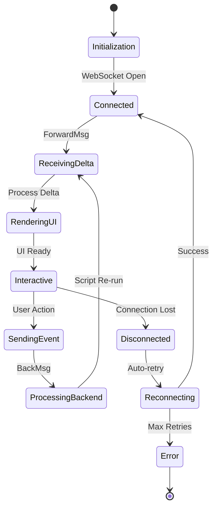
```mermaid
stateDiagram-v2
    [*] --> Initialization
    Initialization --> Connected: WebSocket Open

    Connected --> ReceivingDelta: ForwardMsg
    ReceivingDelta --> RenderingUI: Process Delta
    RenderingUI --> Interactive: UI Ready

    Interactive --> SendingEvent: User Action
    SendingEvent --> ProcessingBackend: BackMsg
    ProcessingBackend --> ReceivingDelta: Script Re-run

    Interactive --> Disconnected: Connection Lost
    Disconnected --> Reconnecting: Auto-retry
    Reconnecting --> Connected: Success
    Reconnecting --> Error: Max Retries

    Error --> [*]
```

## Communication Protocol

### Protocol Buffer Message Flow

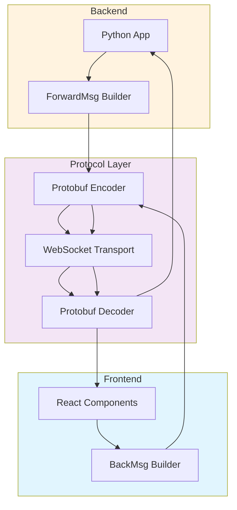
```mermaid
flowchart TB
    subgraph Backend
        PY[Python App]
        FM[ForwardMsg Builder]
        PY --> FM
    end

    subgraph Protocol[Protocol Layer]
        PBE[Protobuf Encoder]
        WS1[WebSocket Transport]
        PBD[Protobuf Decoder]
    end

    subgraph Frontend
        BM[BackMsg Builder]
        RC[React Components]
        RC --> BM
    end

    FM --> PBE
    PBE --> WS1
    WS1 --> PBD
    PBD --> RC

    BM --> PBE
    PBE --> WS1
    WS1 --> PBD
    PBD --> PY

    style Backend fill:#fff3e0
    style Protocol fill:#f3e5f5
    style Frontend fill:#e1f5fe
```

### Message Types

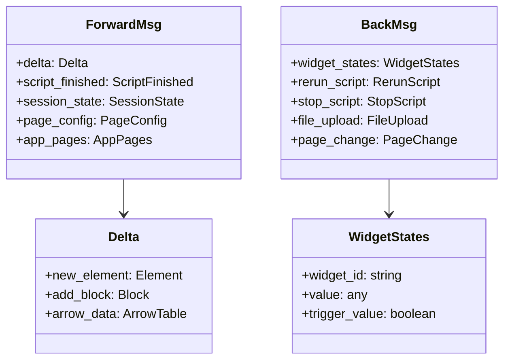
```mermaid
classDiagram
    class ForwardMsg {
        +delta: Delta
        +script_finished: ScriptFinished
        +session_state: SessionState
        +page_config: PageConfig
        +app_pages: AppPages
    }

    class BackMsg {
        +widget_states: WidgetStates
        +rerun_script: RerunScript
        +stop_script: StopScript
        +file_upload: FileUpload
        +page_change: PageChange
    }

    class Delta {
        +new_element: Element
        +add_block: Block
        +arrow_data: ArrowTable
    }

    class WidgetStates {
        +widget_id: string
        +value: any
        +trigger_value: boolean
    }

    ForwardMsg --> Delta
    BackMsg --> WidgetStates
```

## Testing Infrastructure

### Test Architecture

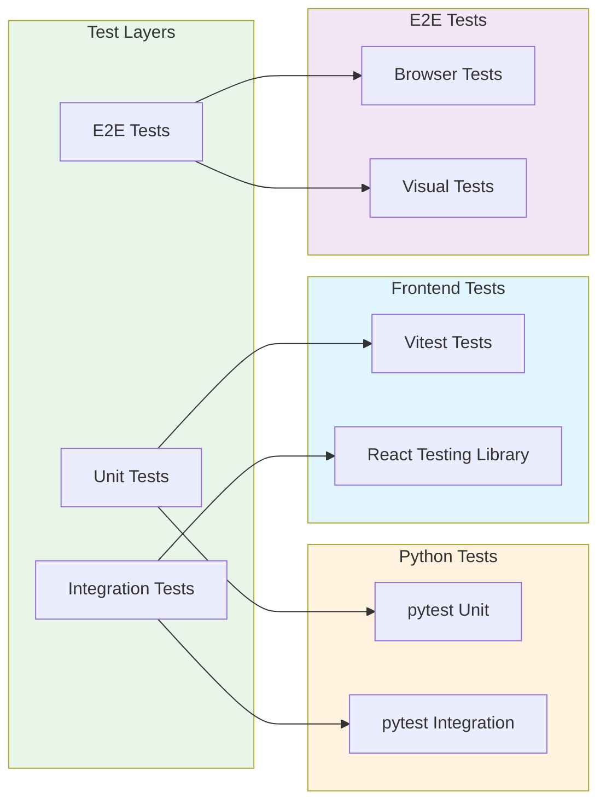
```mermaid
graph LR
    subgraph Testing[Test Layers]
        UT[Unit Tests]
        IT[Integration Tests]
        E2E[E2E Tests]
    end

    subgraph Python[Python Tests]
        PU[pytest Unit]
        PI[pytest Integration]
    end

    subgraph TypeScript[Frontend Tests]
        VT[Vitest Tests]
        RTL[React Testing Library]
    end

    subgraph Playwright[E2E Tests]
        BR[Browser Tests]
        VI[Visual Tests]
    end

    UT --> PU
    UT --> VT
    IT --> PI
    IT --> RTL
    E2E --> BR
    E2E --> VI

    style Testing fill:#e8f5e9
    style Python fill:#fff3e0
    style TypeScript fill:#e1f5fe
    style Playwright fill:#f3e5f5
```

## Development Workflow

### Development Process Flow

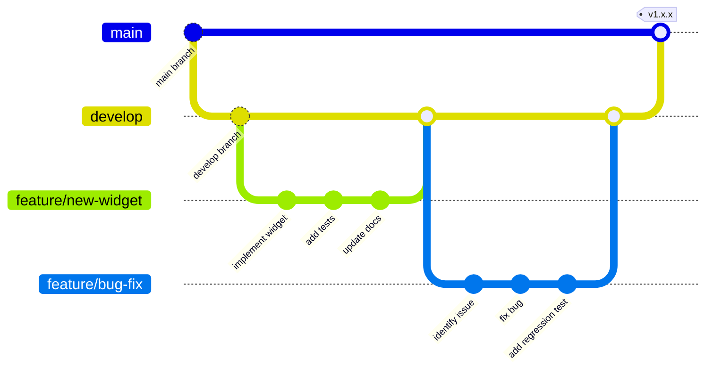
```mermaid
gitGraph
    commit id: "main branch"
    branch develop
    commit id: "develop branch"

    branch feature/new-widget
    commit id: "implement widget"
    commit id: "add tests"
    commit id: "update docs"

    checkout develop
    merge feature/new-widget

    branch feature/bug-fix
    commit id: "identify issue"
    commit id: "fix bug"
    commit id: "add regression test"

    checkout develop
    merge feature/bug-fix

    checkout main
    merge develop tag: "v1.x.x"
```

### Build Pipeline

```mermaid
flowchart LR
    subgraph Local[Local Development]
        Edit[Edit Code]
        Test[Run Tests]
        Build[Build Assets]
    end

    subgraph CI[CI Pipeline]
        Lint[Linting]
        Unit[Unit Tests]
        Integration[Integration Tests]
        E2ET[E2E Tests]
    end

    subgraph CD[CD Pipeline]
        Package[Package Build]
        Publish[Publish to PyPI]
        Deploy[Deploy Docs]
    end

    Edit --> Test
    Test --> Build
    Build --> Lint
    Lint --> Unit
    Unit --> Integration
    Integration --> E2ET
    E2ET --> Package
    Package --> Publish
    Publish --> Deploy

    style Local fill:#e8f5e9
    style CI fill:#fff3e0
    style CD fill:#e1f5fe
```

## Performance Architecture

### Caching Strategy

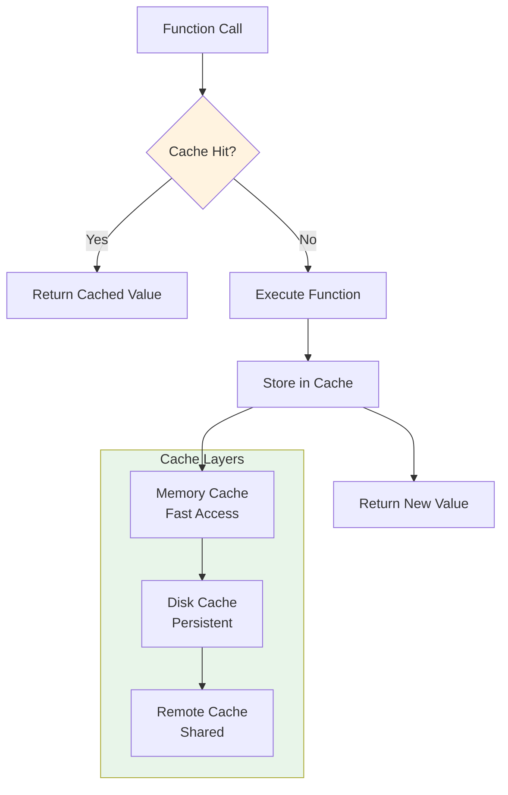
```mermaid
flowchart TD
    Request[Function Call]

    Request --> CacheCheck{Cache Hit?}
    CacheCheck -->|Yes| ReturnCached[Return Cached Value]
    CacheCheck -->|No| Execute[Execute Function]

    Execute --> StoreResult[Store in Cache]
    StoreResult --> ReturnNew[Return New Value]

    subgraph CacheLayers[Cache Layers]
        L1[Memory Cache<br/>Fast Access]
        L2[Disk Cache<br/>Persistent]
        L3[Remote Cache<br/>Shared]
    end

    StoreResult --> L1
    L1 --> L2
    L2 --> L3

    style CacheCheck fill:#fff3e0
    style CacheLayers fill:#e8f5e9
```

### Data Flow Optimization

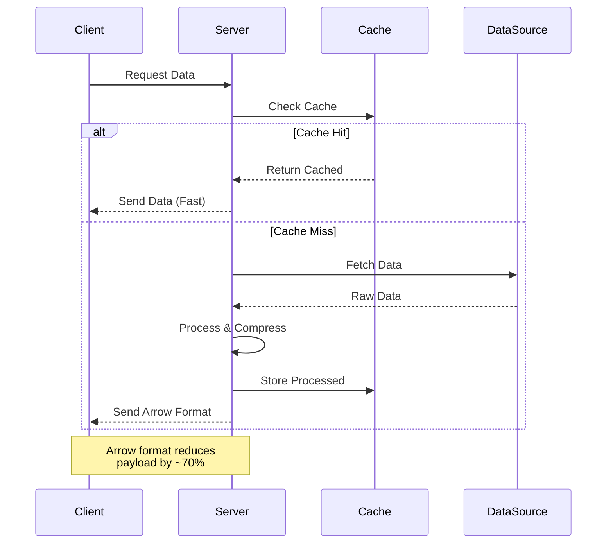
```mermaid
sequenceDiagram
    participant Client
    participant Server
    participant Cache
    participant DataSource

    Client->>Server: Request Data
    Server->>Cache: Check Cache

    alt Cache Hit
        Cache-->>Server: Return Cached
        Server-->>Client: Send Data (Fast)
    else Cache Miss
        Server->>DataSource: Fetch Data
        DataSource-->>Server: Raw Data
        Server->>Server: Process & Compress
        Server->>Cache: Store Processed
        Server-->>Client: Send Arrow Format
    end

    Note over Client,Server: Arrow format reduces<br/>payload by ~70%
```

## Deployment Architecture

### Production Deployment

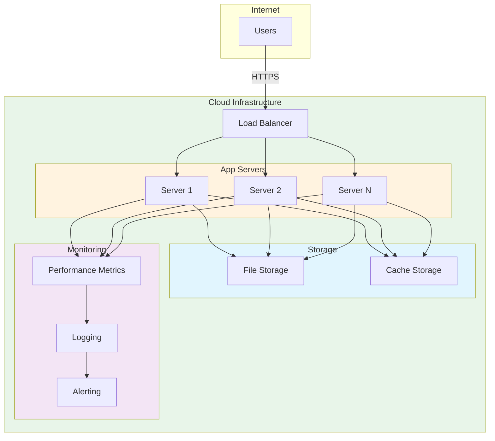
```mermaid
graph TB
    subgraph Internet
        Users[Users]
    end

    subgraph CloudProvider[Cloud Infrastructure]
        LB[Load Balancer]

        subgraph AppServers[App Servers]
            S1[Server 1]
            S2[Server 2]
            S3[Server N]
        end

        subgraph Storage
            FS[File Storage]
            CS[Cache Storage]
        end

        subgraph Monitoring
            PM[Performance Metrics]
            LG[Logging]
            AL[Alerting]
        end
    end

    Users -->|HTTPS| LB
    LB --> S1
    LB --> S2
    LB --> S3

    S1 --> FS
    S2 --> FS
    S3 --> FS

    S1 --> CS
    S2 --> CS
    S3 --> CS

    S1 --> PM
    S2 --> PM
    S3 --> PM

    PM --> LG
    LG --> AL

    style CloudProvider fill:#e8f5e9
    style AppServers fill:#fff3e0
    style Storage fill:#e1f5fe
    style Monitoring fill:#f3e5f5
```

### Container Architecture

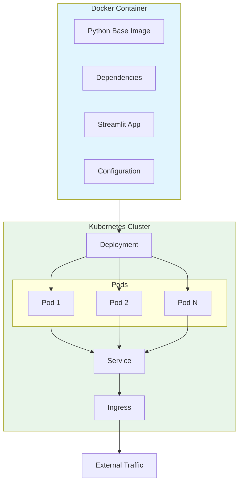
```mermaid
graph TD
    subgraph DockerImage[Docker Container]
        Base[Python Base Image]
        Deps[Dependencies]
        App[Streamlit App]
        Config[Configuration]
    end

    subgraph Orchestration[Kubernetes Cluster]
        Deploy[Deployment]
        Service[Service]
        Ingress[Ingress]

        subgraph Pods
            P1[Pod 1]
            P2[Pod 2]
            P3[Pod N]
        end
    end

    DockerImage --> Deploy
    Deploy --> P1
    Deploy --> P2
    Deploy --> P3

    P1 --> Service
    P2 --> Service
    P3 --> Service

    Service --> Ingress
    Ingress --> External[External Traffic]

    style DockerImage fill:#e1f5fe
    style Orchestration fill:#e8f5e9
```

## Security Architecture

### Security Layers

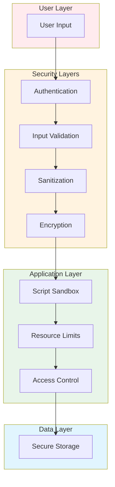
```mermaid
flowchart TB
    subgraph UserLayer[User Layer]
        U[User Input]
    end

    subgraph SecurityLayers[Security Layers]
        Auth[Authentication]
        Val[Input Validation]
        San[Sanitization]
        Enc[Encryption]
    end

    subgraph AppLayer[Application Layer]
        Sandbox[Script Sandbox]
        Limits[Resource Limits]
        Access[Access Control]
    end

    subgraph DataLayer[Data Layer]
        Secure[Secure Storage]
    end

    U --> Auth
    Auth --> Val
    Val --> San
    San --> Enc
    Enc --> Sandbox
    Sandbox --> Limits
    Limits --> Access
    Access --> Secure

    style UserLayer fill:#ffebee
    style SecurityLayers fill:#fff3e0
    style AppLayer fill:#e8f5e9
    style DataLayer fill:#e1f5fe
```

## Widget Lifecycle

### Widget State Management

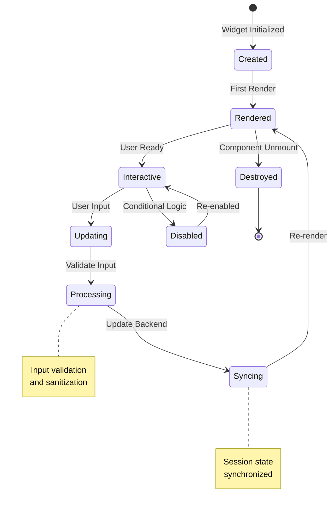
```mermaid
stateDiagram-v2
    [*] --> Created: Widget Initialized
    Created --> Rendered: First Render
    Rendered --> Interactive: User Ready

    Interactive --> Updating: User Input
    Updating --> Processing: Validate Input
    Processing --> Syncing: Update Backend
    Syncing --> Rendered: Re-render

    Interactive --> Disabled: Conditional Logic
    Disabled --> Interactive: Re-enabled

    Rendered --> Destroyed: Component Unmount
    Destroyed --> [*]

    note right of Syncing: Session state<br/>synchronized
    note right of Processing: Input validation<br/>and sanitization
```

## Custom Component Architecture

### Component Communication

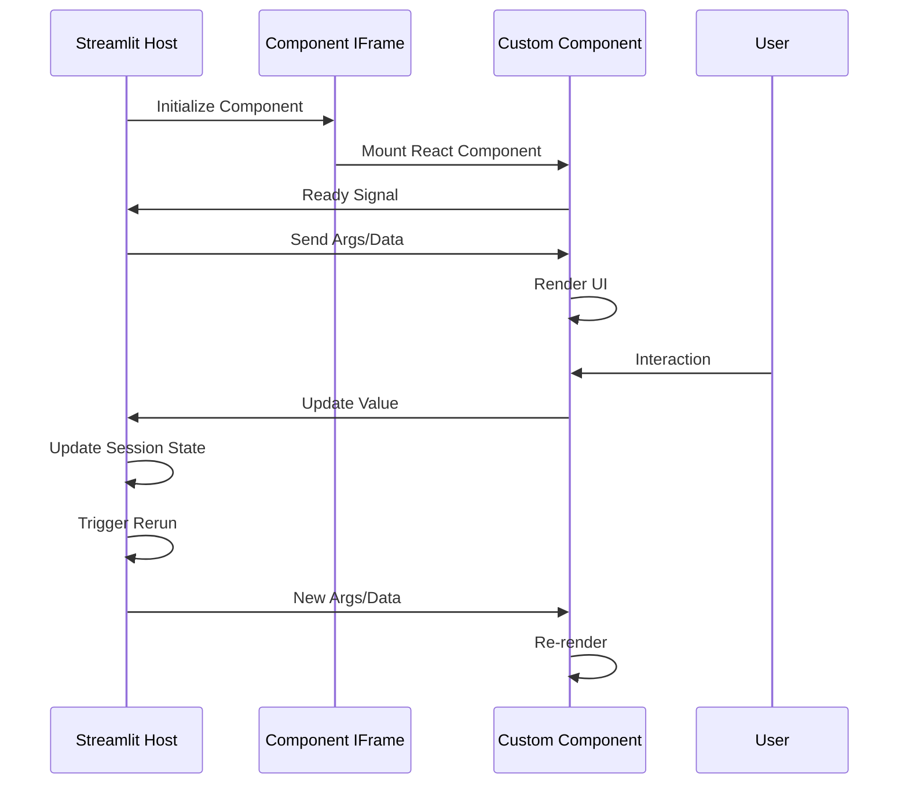
```mermaid
sequenceDiagram
    participant Host as Streamlit Host
    participant IFrame as Component IFrame
    participant Comp as Custom Component
    participant User as User

    Host->>IFrame: Initialize Component
    IFrame->>Comp: Mount React Component
    Comp->>Host: Ready Signal

    Host->>Comp: Send Args/Data
    Comp->>Comp: Render UI

    User->>Comp: Interaction
    Comp->>Host: Update Value
    Host->>Host: Update Session State
    Host->>Host: Trigger Rerun

    Host->>Comp: New Args/Data
    Comp->>Comp: Re-render
```

## Performance Metrics

### System Performance Characteristics

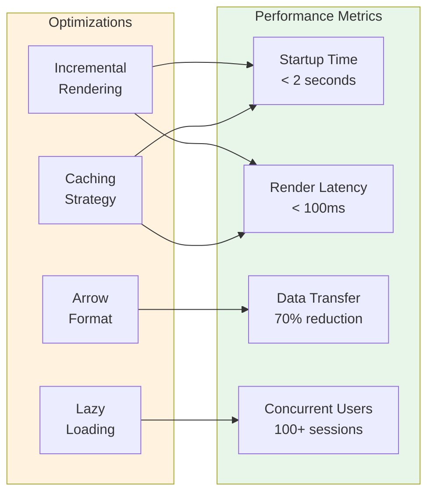
```mermaid
graph LR
    subgraph Metrics[Performance Metrics]
        ST[Startup Time<br/>< 2 seconds]
        RL[Render Latency<br/>< 100ms]
        DT[Data Transfer<br/>70% reduction]
        CU[Concurrent Users<br/>100+ sessions]
    end

    subgraph Optimizations[Optimizations]
        IR[Incremental<br/>Rendering]
        CS[Caching<br/>Strategy]
        AF[Arrow<br/>Format]
        LP[Lazy<br/>Loading]
    end

    IR --> ST
    IR --> RL
    CS --> ST
    CS --> RL
    AF --> DT
    LP --> CU

    style Metrics fill:#e8f5e9
    style Optimizations fill:#fff3e0
```

## Development Commands

### Make Command Workflow

```mermaid
flowchart TD
    Start([Developer])

    Start --> Init{First Time?}
    Init -->|Yes| MakeInit[make init]
    Init -->|No| Dev{Development Type}

    MakeInit --> Dev

    Dev -->|Frontend| FrontendDev[make frontend-dev]
    Dev -->|Backend| BackendDev[pip install -e .]
    Dev -->|Full Stack| BothDev[Both Commands]

    FrontendDev --> Testing
    BackendDev --> Testing
    BothDev --> Testing

    Testing{Run Tests?}
    Testing -->|Python| PyTest[make python-tests]
    Testing -->|Frontend| FETest[make frontend-tests]
    Testing -->|E2E| E2ETest[make run-e2e-test]
    Testing -->|All| AllTest[All Test Commands]

    PyTest --> Quality
    FETest --> Quality
    E2ETest --> Quality
    AllTest --> Quality

    Quality{Code Quality?}
    Quality -->|Lint| Lint[make python-lint<br/>make frontend-lint]
    Quality -->|Format| Format[make autofix]

    style Start fill:#e8f5e9
    style MakeInit fill:#fff3e0
    style Testing fill:#e1f5fe
    style Quality fill:#f3e5f5
```

## API Layer Architecture

### API Request Flow

```mermaid
sequenceDiagram
    participant App as Streamlit App
    participant API as API Layer
    participant DG as Delta Generator
    participant SR as Script Runner
    participant Cache as Cache System
    participant UI as UI Renderer

    App->>API: st.write("Hello")
    API->>DG: Create Delta
    DG->>SR: Execute in Context
    SR->>Cache: Check Cache

    alt Cached Result
        Cache-->>SR: Return Cached
    else New Computation
        SR->>SR: Process
        SR->>Cache: Store Result
    end

    SR->>DG: Generate UI Delta
    DG->>UI: Send ForwardMsg
    UI->>UI: Render Component
    UI-->>App: Display Output
```

## State Synchronization

### Session State Synchronization

```mermaid
flowchart TB
    subgraph Browser[Browser Session]
        UI[UI State]
        WS[WebSocket Client]
    end

    subgraph Server[Server Session]
        SS[Session State]
        WM[Widget Manager]
        SR[Script Runner]
    end

    UI -->|User Input| WS
    WS -->|BackMsg| WM
    WM -->|Update| SS
    SS -->|Trigger| SR
    SR -->|Rerun| SR
    SR -->|Delta| WM
    WM -->|ForwardMsg| WS
    WS -->|Update| UI

    style Browser fill:#e1f5fe
    style Server fill:#fff3e0
```

## Contributing Guidelines

### Contribution Workflow

```mermaid
flowchart LR
    Fork[Fork Repository]
    Clone[Clone Fork]
    Branch[Create Branch]
    Code[Write Code]
    Test[Add Tests]
    Commit[Commit Changes]
    Push[Push Branch]
    PR[Open Pull Request]
    Review[Code Review]
    Merge[Merge to Main]

    Fork --> Clone
    Clone --> Branch
    Branch --> Code
    Code --> Test
    Test --> Commit
    Commit --> Push
    Push --> PR
    PR --> Review
    Review --> Merge

    Review -->|Changes Requested| Code

    style Fork fill:#e8f5e9
    style PR fill:#fff3e0
    style Merge fill:#e1f5fe
```

## Resources

### Documentation

- [Official Documentation](https://docs.streamlit.io)
- [API Reference](https://docs.streamlit.io/library/api-reference)
- [Component Development](https://docs.streamlit.io/library/components)

### Community

- GitHub Issues: Bug reports and feature requests
- Discussions: Technical questions and proposals
- Contributing: See CONTRIBUTING.md

## License

Apache License 2.0 - See LICENSE file for details

---

*This documentation provides a comprehensive technical overview of the Streamlit codebase with detailed architectural diagrams. For specific implementation details, refer to the inline documentation and component-specific README files.*
