# Streamlit vs Flask: Comprehensive Architecture Comparison & Decision Guide

## Executive Summary

This document provides a detailed technical comparison between **Streamlit** and **Flask + Web Frontend** architectures for Python web applications. It analyzes when to use each framework based on project requirements, team expertise, scalability needs, and application complexity.

## Table of Contents

1. [Architecture Overview](#architecture-overview)
2. [Technical Comparison](#technical-comparison)
3. [Use Case Analysis](#use-case-analysis)
4. [Performance & Scalability](#performance--scalability)
5. [Development Workflow](#development-workflow)
6. [Decision Matrix](#decision-matrix)
7. [Migration Strategies](#migration-strategies)
8. [Recommendations](#recommendations)

## Architecture Overview

### Streamlit Architecture

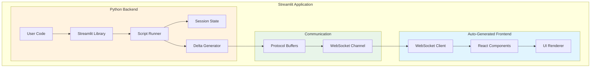
```mermaid
graph TB
    subgraph StreamlitApp[Streamlit Application]
        subgraph Backend[Python Backend]
            UC[User Code]
            ST[Streamlit Library]
            SR[Script Runner]
            SS[Session State]
            DG[Delta Generator]
        end

        subgraph Frontend[Auto-Generated Frontend]
            RC[React Components]
            WS[WebSocket Client]
            UI[UI Renderer]
        end

        subgraph Protocol[Communication]
            PB[Protocol Buffers]
            WSC[WebSocket Channel]
        end
    end

    UC --> ST
    ST --> SR
    SR --> SS
    SR --> DG
    DG --> PB
    PB --> WSC
    WSC --> WS
    WS --> RC
    RC --> UI

    style Backend fill:#fff3e0
    style Frontend fill:#e1f5fe
    style Protocol fill:#e8f5e9
```

### Flask + Web Frontend Architecture

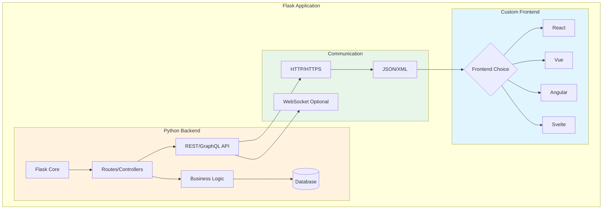
```mermaid
graph TB
    subgraph FlaskApp[Flask Application]
        subgraph Backend[Python Backend]
            FL[Flask Core]
            RT[Routes/Controllers]
            BL[Business Logic]
            DB[(Database)]
            API[REST/GraphQL API]
        end

        subgraph Frontend[Custom Frontend]
            choice{Frontend Choice}
            RE[React]
            VU[Vue]
            AN[Angular]
            SV[Svelte]
        end

        subgraph Communication[Communication]
            HTTP[HTTP/HTTPS]
            WS2[WebSocket Optional]
            JSON[JSON/XML]
        end
    end

    FL --> RT
    RT --> BL
    BL --> DB
    RT --> API
    API --> HTTP
    API --> WS2
    HTTP --> JSON
    JSON --> choice
    choice --> RE
    choice --> VU
    choice --> AN
    choice --> SV

    style Backend fill:#fff3e0
    style Frontend fill:#e1f5fe
    style Communication fill:#e8f5e9
```

## Technical Comparison

### Core Architecture Differences

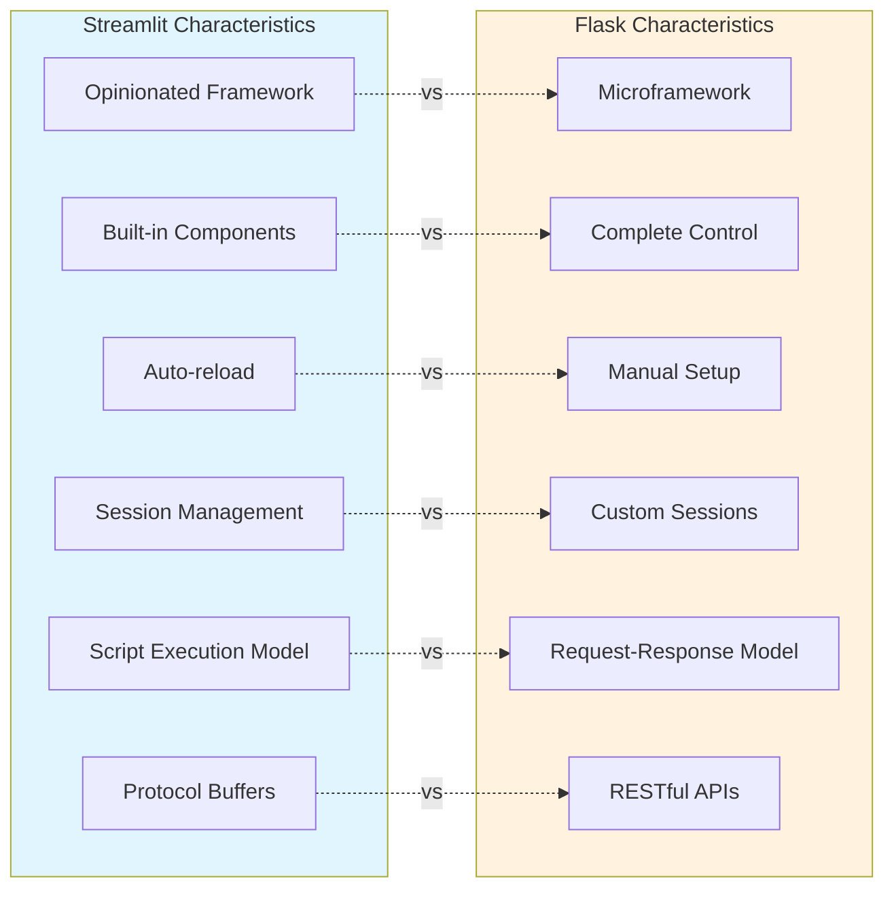
```mermaid
graph LR
    subgraph Streamlit[Streamlit Characteristics]
        S1[Opinionated Framework]
        S2[Built-in Components]
        S3[Auto-reload]
        S4[Session Management]
        S5[Script Execution Model]
        S6[Protocol Buffers]
    end

    subgraph Flask[Flask Characteristics]
        F1[Microframework]
        F2[Complete Control]
        F3[Manual Setup]
        F4[Custom Sessions]
        F5[Request-Response Model]
        F6[RESTful APIs]
    end

    S1 -.->|vs| F1
    S2 -.->|vs| F2
    S3 -.->|vs| F3
    S4 -.->|vs| F4
    S5 -.->|vs| F5
    S6 -.->|vs| F6

    style Streamlit fill:#e1f5fe
    style Flask fill:#fff3e0
```

### Development Speed Comparison

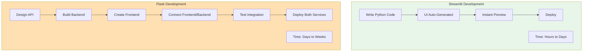
```mermaid
flowchart TD
    subgraph StreamlitDev[Streamlit Development]
        ST1[Write Python Code]
        ST2[UI Auto-Generated]
        ST3[Instant Preview]
        ST4[Deploy]
        ST1 --> ST2
        ST2 --> ST3
        ST3 --> ST4
        STTime[Time: Hours to Days]
    end

    subgraph FlaskDev[Flask Development]
        FL1[Design API]
        FL2[Build Backend]
        FL3[Create Frontend]
        FL4[Connect Frontend/Backend]
        FL5[Test Integration]
        FL6[Deploy Both Services]
        FL1 --> FL2
        FL2 --> FL3
        FL3 --> FL4
        FL4 --> FL5
        FL5 --> FL6
        FLTime[Time: Days to Weeks]
    end

    style StreamlitDev fill:#e8f5e9
    style FlaskDev fill:#ffe0b2
```

## Use Case Analysis

### When to Use Streamlit

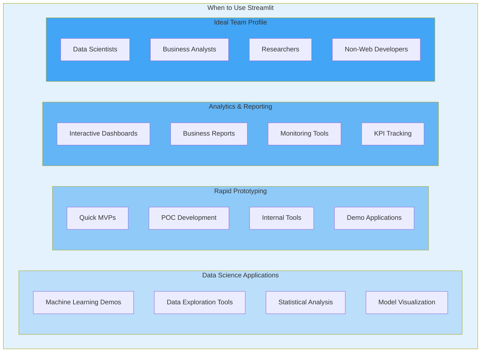
```mermaid
graph TD
    subgraph StreamlitUseCases[When to Use Streamlit]
        subgraph DataScience[Data Science Applications]
            DS1[Machine Learning Demos]
            DS2[Data Exploration Tools]
            DS3[Statistical Analysis]
            DS4[Model Visualization]
        end

        subgraph Prototyping[Rapid Prototyping]
            PR1[Quick MVPs]
            PR2[POC Development]
            PR3[Internal Tools]
            PR4[Demo Applications]
        end

        subgraph Analytics[Analytics & Reporting]
            AN1[Interactive Dashboards]
            AN2[Business Reports]
            AN3[Monitoring Tools]
            AN4[KPI Tracking]
        end

        subgraph TeamProfile[Ideal Team Profile]
            TP1[Data Scientists]
            TP2[Business Analysts]
            TP3[Researchers]
            TP4[Non-Web Developers]
        end
    end

    style StreamlitUseCases fill:#e3f2fd
    style DataScience fill:#bbdefb
    style Prototyping fill:#90caf9
    style Analytics fill:#64b5f6
    style TeamProfile fill:#42a5f5
```

### When to Use Flask + Frontend

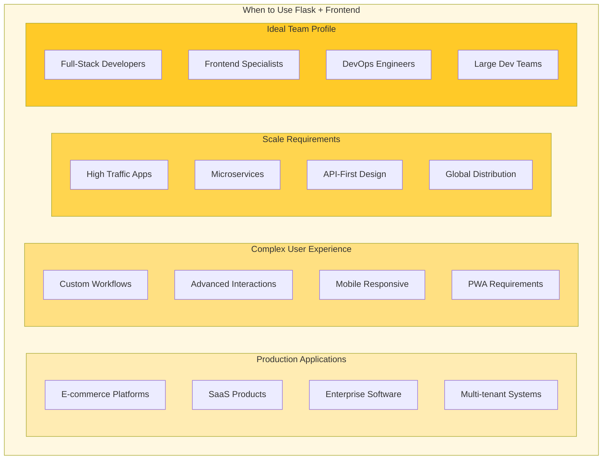
```mermaid
graph TD
    subgraph FlaskUseCases[When to Use Flask + Frontend]
        subgraph ProductionApps[Production Applications]
            PA1[E-commerce Platforms]
            PA2[SaaS Products]
            PA3[Enterprise Software]
            PA4[Multi-tenant Systems]
        end

        subgraph ComplexUX[Complex User Experience]
            UX1[Custom Workflows]
            UX2[Advanced Interactions]
            UX3[Mobile Responsive]
            UX4[PWA Requirements]
        end

        subgraph ScaleReq[Scale Requirements]
            SC1[High Traffic Apps]
            SC2[Microservices]
            SC3[API-First Design]
            SC4[Global Distribution]
        end

        subgraph TeamProfile2[Ideal Team Profile]
            TP5[Full-Stack Developers]
            TP6[Frontend Specialists]
            TP7[DevOps Engineers]
            TP8[Large Dev Teams]
        end
    end

    style FlaskUseCases fill:#fff8e1
    style ProductionApps fill:#ffecb3
    style ComplexUX fill:#ffe082
    style ScaleReq fill:#ffd54f
    style TeamProfile2 fill:#ffca28
```

## Performance & Scalability

### Scalability Architecture Comparison

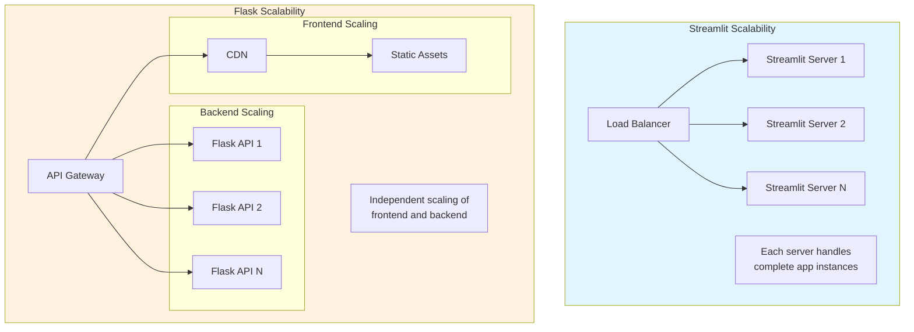
```mermaid
graph TB
    subgraph StreamlitScale[Streamlit Scalability]
        ST_LB[Load Balancer]
        ST_S1[Streamlit Server 1]
        ST_S2[Streamlit Server 2]
        ST_S3[Streamlit Server N]

        ST_LB --> ST_S1
        ST_LB --> ST_S2
        ST_LB --> ST_S3

        note1[Each server handles<br/>complete app instances]
    end

    subgraph FlaskScale[Flask Scalability]
        FL_LB[API Gateway]

        subgraph BackendScale[Backend Scaling]
            FL_B1[Flask API 1]
            FL_B2[Flask API 2]
            FL_B3[Flask API N]
        end

        subgraph FrontendScale[Frontend Scaling]
            CDN[CDN]
            FL_F1[Static Assets]
        end

        FL_LB --> FL_B1
        FL_LB --> FL_B2
        FL_LB --> FL_B3
        FL_LB --> CDN
        CDN --> FL_F1

        note2[Independent scaling of<br/>frontend and backend]
    end

    style StreamlitScale fill:#e1f5fe
    style FlaskScale fill:#fff3e0
```

### Performance Metrics Comparison

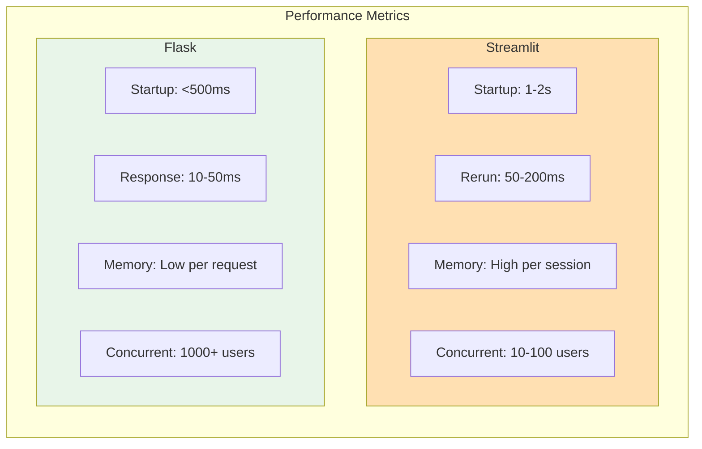
```mermaid
graph LR
    subgraph Metrics[Performance Metrics]
        subgraph StreamlitPerf[Streamlit]
            SP1[Startup: 1-2s]
            SP2[Rerun: 50-200ms]
            SP3[Memory: High per session]
            SP4[Concurrent: 10-100 users]
        end

        subgraph FlaskPerf[Flask]
            FP1[Startup: <500ms]
            FP2[Response: 10-50ms]
            FP3[Memory: Low per request]
            FP4[Concurrent: 1000+ users]
        end
    end

    style StreamlitPerf fill:#ffe0b2
    style FlaskPerf fill:#e8f5e9
```

## Development Workflow

### Development Lifecycle Comparison

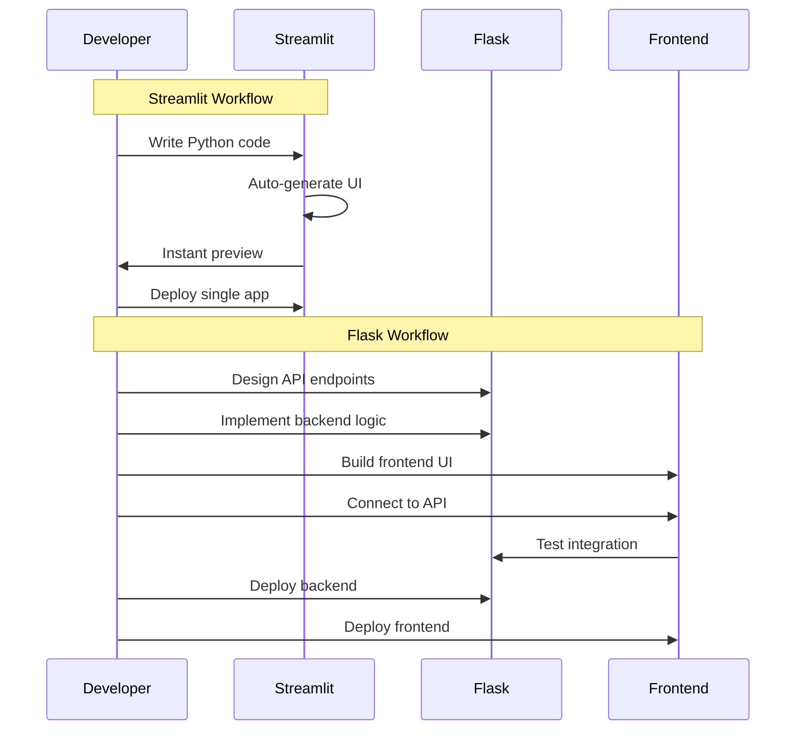
```mermaid
sequenceDiagram
    participant Dev as Developer
    participant ST as Streamlit
    participant FL as Flask
    participant FE as Frontend

    Note over Dev,ST: Streamlit Workflow
    Dev->>ST: Write Python code
    ST->>ST: Auto-generate UI
    ST->>Dev: Instant preview
    Dev->>ST: Deploy single app

    Note over Dev,FE: Flask Workflow
    Dev->>FL: Design API endpoints
    Dev->>FL: Implement backend logic
    Dev->>FE: Build frontend UI
    Dev->>FE: Connect to API
    FE->>FL: Test integration
    Dev->>FL: Deploy backend
    Dev->>FE: Deploy frontend
```

### Team Collaboration Model

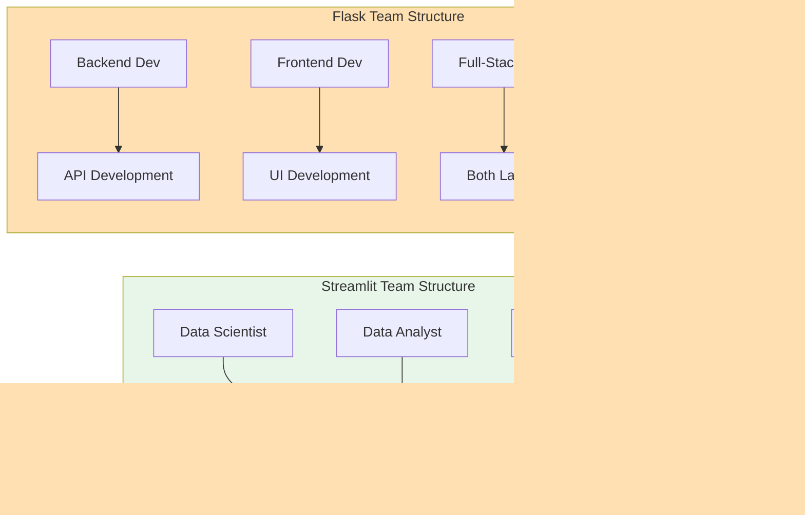
```mermaid
flowchart LR
    subgraph StreamlitTeam[Streamlit Team Structure]
        DS[Data Scientist]
        DA[Data Analyst]
        ML[ML Engineer]

        DS --> Code1[Single Codebase]
        DA --> Code1
        ML --> Code1
    end

    subgraph FlaskTeam[Flask Team Structure]
        BE[Backend Dev]
        FE2[Frontend Dev]
        FS[Full-Stack Dev]
        UX[UX Designer]

        BE --> API2[API Development]
        FE2 --> UI2[UI Development]
        FS --> Both[Both Layers]
        UX --> Design[Design System]
    end

    style StreamlitTeam fill:#e8f5e9
    style FlaskTeam fill:#ffe0b2
```

## Decision Matrix

### Project Requirements Decision Tree

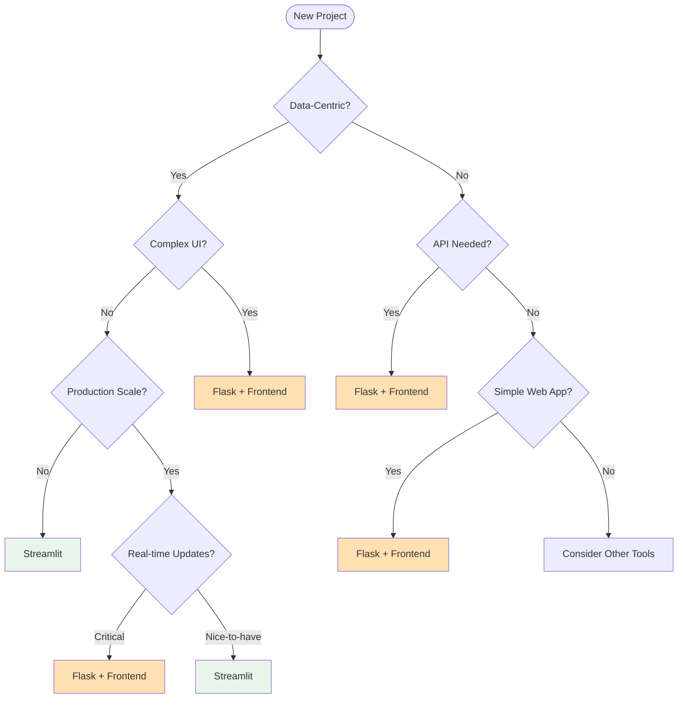
```mermaid
flowchart TD
    Start([New Project])
    Start --> Q1{Data-Centric?}

    Q1 -->|Yes| Q2{Complex UI?}
    Q1 -->|No| Q3{API Needed?}

    Q2 -->|No| Q4{Production Scale?}
    Q2 -->|Yes| Flask1[Flask + Frontend]

    Q3 -->|Yes| Flask2[Flask + Frontend]
    Q3 -->|No| Q5{Simple Web App?}

    Q4 -->|No| Streamlit1[Streamlit]
    Q4 -->|Yes| Q6{Real-time Updates?}

    Q5 -->|Yes| Flask3[Flask + Frontend]
    Q5 -->|No| Other[Consider Other Tools]

    Q6 -->|Critical| Flask4[Flask + Frontend]
    Q6 -->|Nice-to-have| Streamlit2[Streamlit]

    style Streamlit1 fill:#e8f5e9
    style Streamlit2 fill:#e8f5e9
    style Flask1 fill:#ffe0b2
    style Flask2 fill:#ffe0b2
    style Flask3 fill:#ffe0b2
    style Flask4 fill:#ffe0b2
```

### Feature Comparison Matrix

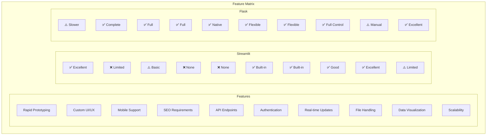
```mermaid
graph TD
    subgraph Matrix[Feature Matrix]
        subgraph Features[Features]
            F1[Rapid Prototyping]
            F2[Custom UI/UX]
            F3[Mobile Support]
            F4[SEO Requirements]
            F5[API Endpoints]
            F6[Authentication]
            F7[Real-time Updates]
            F8[File Handling]
            F9[Data Visualization]
            F10[Scalability]
        end

        subgraph StreamlitSupport[Streamlit]
            S1[✅ Excellent]
            S2[❌ Limited]
            S3[⚠️ Basic]
            S4[❌ None]
            S5[❌ None]
            S6[✅ Built-in]
            S7[✅ Built-in]
            S8[✅ Good]
            S9[✅ Excellent]
            S10[⚠️ Limited]
        end

        subgraph FlaskSupport[Flask]
            FL1[⚠️ Slower]
            FL2[✅ Complete]
            FL3[✅ Full]
            FL4[✅ Full]
            FL5[✅ Native]
            FL6[✅ Flexible]
            FL7[✅ Flexible]
            FL8[✅ Full Control]
            FL9[⚠️ Manual]
            FL10[✅ Excellent]
        end
    end
```

## Migration Strategies

### Streamlit to Flask Migration Path

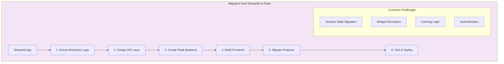
```mermaid
flowchart TB
    subgraph Migration[Migration from Streamlit to Flask]
        ST_App[Streamlit App]

        Step1[1. Extract Business Logic]
        Step2[2. Design API Layer]
        Step3[3. Create Flask Backend]
        Step4[4. Build Frontend]
        Step5[5. Migrate Features]
        Step6[6. Test & Deploy]

        ST_App --> Step1
        Step1 --> Step2
        Step2 --> Step3
        Step3 --> Step4
        Step4 --> Step5
        Step5 --> Step6

        subgraph Challenges[Common Challenges]
            C1[Session State Migration]
            C2[Widget Recreation]
            C3[Caching Logic]
            C4[Authentication]
        end
    end

    style Migration fill:#f3e5f5
```

### Hybrid Architecture Option

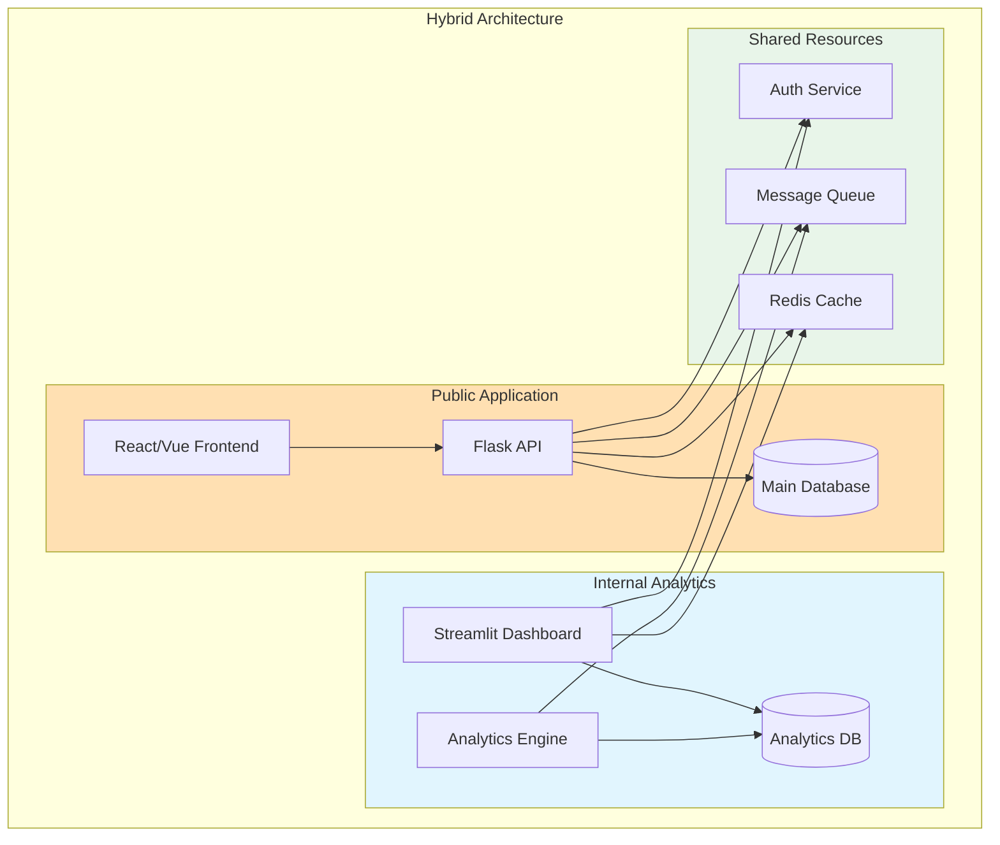
```mermaid
graph TB
    subgraph HybridArch[Hybrid Architecture]
        subgraph PublicFacing[Public Application]
            Flask[Flask API]
            Frontend[React/Vue Frontend]
            DB1[(Main Database)]
        end

        subgraph InternalTools[Internal Analytics]
            Streamlit[Streamlit Dashboard]
            Analytics[Analytics Engine]
            DB2[(Analytics DB)]
        end

        subgraph Shared[Shared Resources]
            Auth[Auth Service]
            Queue[Message Queue]
            Cache[Redis Cache]
        end

        Flask --> DB1
        Frontend --> Flask
        Streamlit --> DB2
        Analytics --> DB2

        Flask --> Auth
        Streamlit --> Auth
        Flask --> Queue
        Analytics --> Queue
        Flask --> Cache
        Streamlit --> Cache
    end

    style PublicFacing fill:#ffe0b2
    style InternalTools fill:#e1f5fe
    style Shared fill:#e8f5e9
```

## Cost Analysis

### Development & Operational Costs

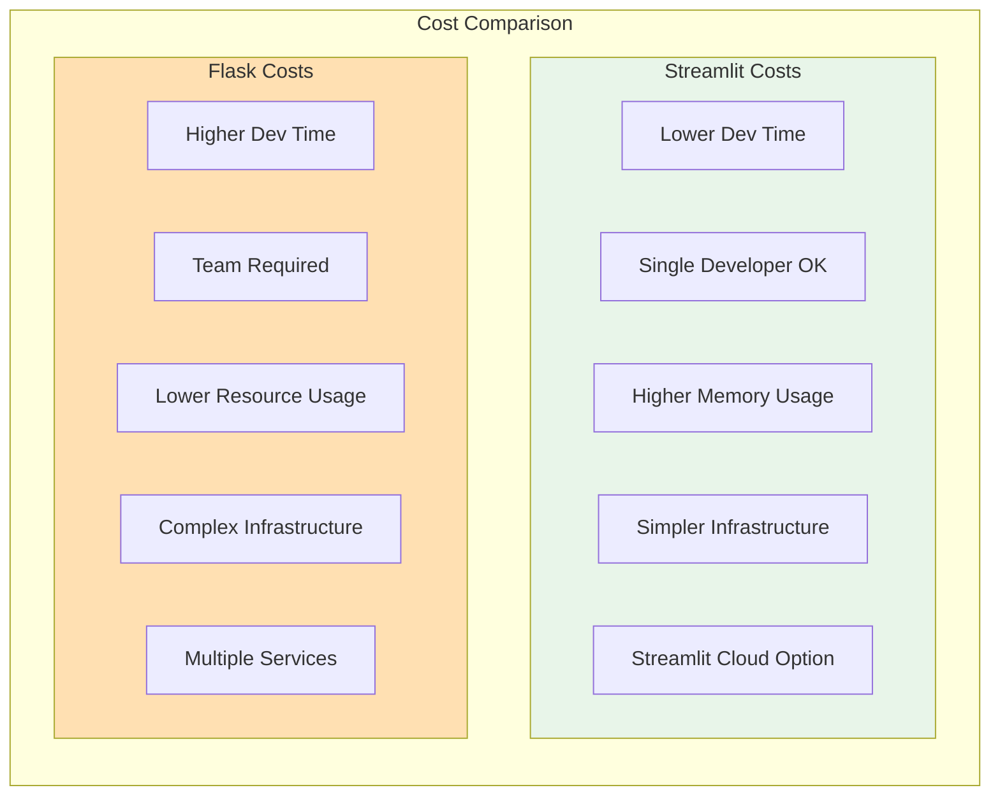
```mermaid
graph LR
    subgraph CostFactors[Cost Comparison]
        subgraph StreamlitCosts[Streamlit Costs]
            SC1[Lower Dev Time]
            SC2[Single Developer OK]
            SC3[Higher Memory Usage]
            SC4[Simpler Infrastructure]
            SC5[Streamlit Cloud Option]
        end

        subgraph FlaskCosts[Flask Costs]
            FC1[Higher Dev Time]
            FC2[Team Required]
            FC3[Lower Resource Usage]
            FC4[Complex Infrastructure]
            FC5[Multiple Services]
        end
    end

    style StreamlitCosts fill:#e8f5e9
    style FlaskCosts fill:#ffe0b2
```

## Technology Stack Comparison

### Full Stack Requirements

```mermaid
flowchart TD
    subgraph StreamlitStack[Streamlit Stack]
        Python1[Python]
        Streamlit1[Streamlit Library]
        Optional1[Optional: Docker]
        Deploy1[Deployment Platform]

        Python1 --> Streamlit1
        Streamlit1 --> Optional1
        Optional1 --> Deploy1
    end

    subgraph FlaskStack[Flask Stack]
        Python2[Python]
        Flask2[Flask Framework]
        Frontend2[JS Framework]
        CSS2[CSS Framework]
        Build2[Build Tools]
        API2[API Design]
        DB2[Database]
        Cache2[Caching Layer]
        Deploy2[2+ Deployments]

        Python2 --> Flask2
        Flask2 --> API2
        API2 --> Frontend2
        Frontend2 --> CSS2
        CSS2 --> Build2
        Flask2 --> DB2
        DB2 --> Cache2
        Build2 --> Deploy2
        Cache2 --> Deploy2
    end

    style StreamlitStack fill:#e8f5e9
    style FlaskStack fill:#ffe0b2
```

## Real-World Examples

### Application Type Recommendations

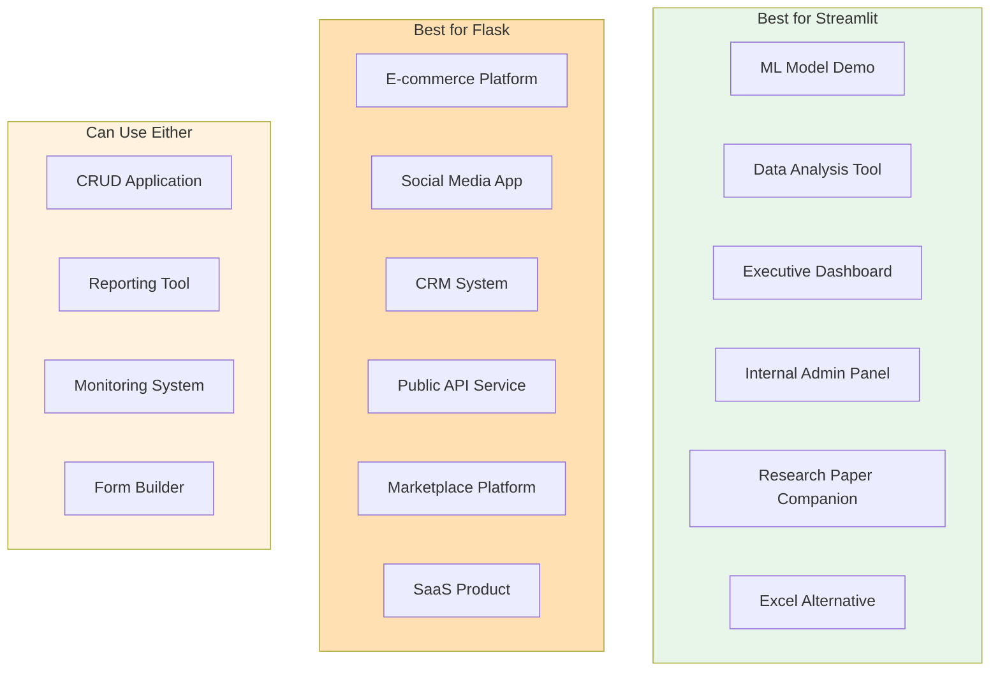
```mermaid
graph TD
    subgraph BestForStreamlit[Best for Streamlit]
        ML1[ML Model Demo]
        DA1[Data Analysis Tool]
        DB1[Executive Dashboard]
        IV1[Internal Admin Panel]
        RP1[Research Paper Companion]
        EX1[Excel Alternative]
    end

    subgraph BestForFlask[Best for Flask]
        EC1[E-commerce Platform]
        SM1[Social Media App]
        CRM1[CRM System]
        API1[Public API Service]
        MP1[Marketplace Platform]
        SAAS1[SaaS Product]
    end

    subgraph CanUseEither[Can Use Either]
        CRUD1[CRUD Application]
        RP2[Reporting Tool]
        MON1[Monitoring System]
        FORM1[Form Builder]
    end

    style BestForStreamlit fill:#e8f5e9
    style BestForFlask fill:#ffe0b2
    style CanUseEither fill:#fff3e0
```

## Security Considerations

### Security Architecture Comparison

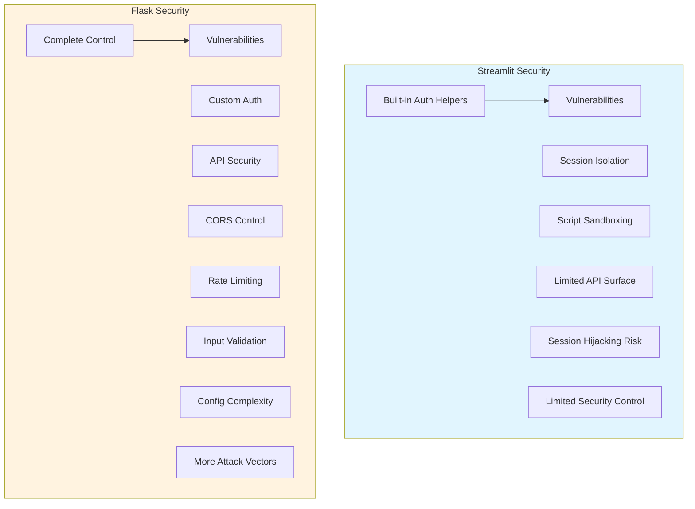
```mermaid
flowchart TB
    subgraph StreamlitSec[Streamlit Security]
        SS1[Built-in Auth Helpers]
        SS2[Session Isolation]
        SS3[Script Sandboxing]
        SS4[Limited API Surface]

        SS1 --> SSVuln[Vulnerabilities]
        SSV1[Session Hijacking Risk]
        SSV2[Limited Security Control]
    end

    subgraph FlaskSec[Flask Security]
        FS1[Complete Control]
        FS2[Custom Auth]
        FS3[API Security]
        FS4[CORS Control]
        FS5[Rate Limiting]
        FS6[Input Validation]

        FS1 --> FSVuln[Vulnerabilities]
        FSV1[Config Complexity]
        FSV2[More Attack Vectors]
    end

    style StreamlitSec fill:#e1f5fe
    style FlaskSec fill:#fff3e0
```

## Recommendations

### Decision Framework

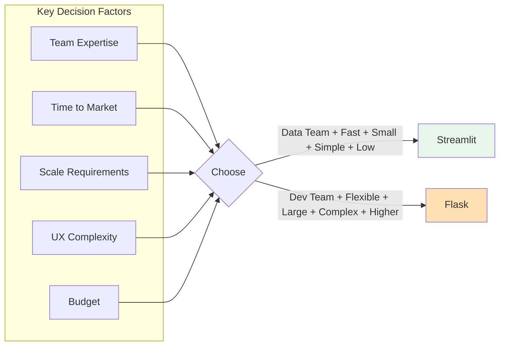
```mermaid
flowchart LR
    subgraph DecisionFactors[Key Decision Factors]
        Team[Team Expertise]
        Time[Time to Market]
        Scale[Scale Requirements]
        UX[UX Complexity]
        Budget[Budget]
    end

    Team --> Choice{Choose}
    Time --> Choice
    Scale --> Choice
    UX --> Choice
    Budget --> Choice

    Choice -->|Data Team + Fast + Small + Simple + Low| Streamlit
    Choice -->|Dev Team + Flexible + Large + Complex + Higher| Flask

    style Streamlit fill:#e8f5e9
    style Flask fill:#ffe0b2
```

### Summary Recommendations

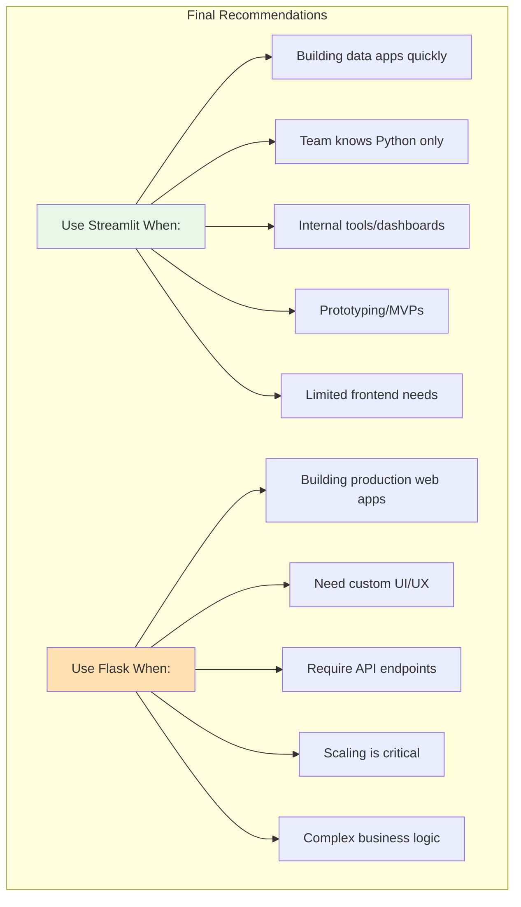
```mermaid
graph TD
    subgraph FinalRec[Final Recommendations]
        UseStreamlit[Use Streamlit When:]
        S1[Building data apps quickly]
        S2[Team knows Python only]
        S3[Internal tools/dashboards]
        S4[Prototyping/MVPs]
        S5[Limited frontend needs]

        UseFlask[Use Flask When:]
        F1[Building production web apps]
        F2[Need custom UI/UX]
        F3[Require API endpoints]
        F4[Scaling is critical]
        F5[Complex business logic]

        UseStreamlit --> S1
        UseStreamlit --> S2
        UseStreamlit --> S3
        UseStreamlit --> S4
        UseStreamlit --> S5

        UseFlask --> F1
        UseFlask --> F2
        UseFlask --> F3
        UseFlask --> F4
        UseFlask --> F5
    end

    style UseStreamlit fill:#e8f5e9
    style UseFlask fill:#ffe0b2
```

## Conclusion

### Technology Selection Matrix

| Factor | Streamlit | Flask + Frontend |
|--------|-----------|------------------|
| **Development Speed** | ⚡ Very Fast | 🐢 Slower |
| **Learning Curve** | 📈 Easy | 📊 Steep |
| **Customization** | 🔒 Limited | 🔓 Unlimited |
| **Scalability** | ⚠️ Limited | ✅ Excellent |
| **Team Size** | 1️⃣ Solo | 👥 Team |
| **Cost** | 💚 Lower | 💛 Higher |
| **Time to Market** | 🚀 Days | 📅 Weeks/Months |
| **Maintenance** | ✅ Simple | ⚠️ Complex |
| **Mobile Support** | ❌ Poor | ✅ Excellent |
| **SEO** | ❌ None | ✅ Full |

### Final Verdict

```mermaid
flowchart TD
    Start[Project Requirements]

    Start --> Analysis[Analyze Needs]
    Analysis --> DataApp{Data-Focused App?}

    DataApp -->|Yes| SimpleUI{Simple UI OK?}
    DataApp -->|No| Flask1[Choose Flask]

    SimpleUI -->|Yes| InternalUse{Internal Use?}
    SimpleUI -->|No| Flask2[Choose Flask]

    InternalUse -->|Yes| Streamlit1[Choose Streamlit]
    InternalUse -->|No| ScaleReq{Scale Required?}

    ScaleReq -->|Low| Streamlit2[Choose Streamlit]
    ScaleReq -->|High| Flask3[Choose Flask]

    style Streamlit1 fill:#4CAF50,color:#fff
    style Streamlit2 fill:#4CAF50,color:#fff
    style Flask1 fill:#2196F3,color:#fff
    style Flask2 fill:#2196F3,color:#fff
    style Flask3 fill:#2196F3,color:#fff
```

---

*This comprehensive guide provides a detailed framework for choosing between Streamlit and Flask based on specific project requirements, team capabilities, and business constraints. The decision should ultimately align with your project's long-term goals and technical requirements.*
